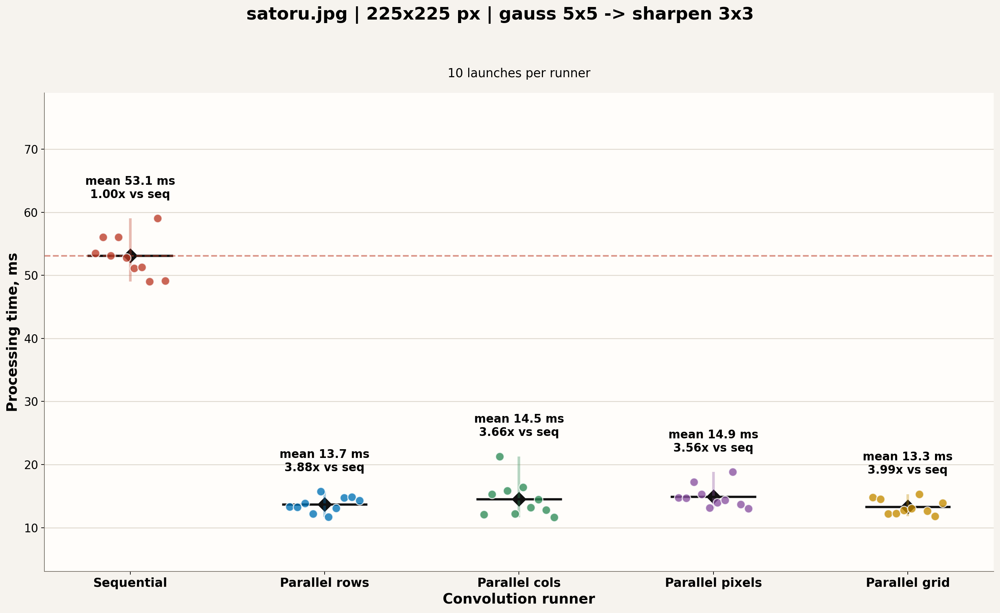
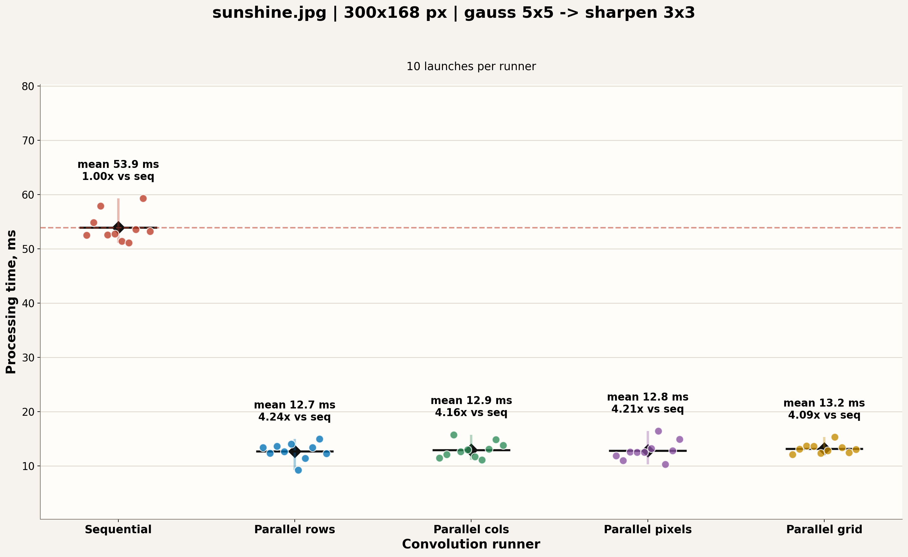
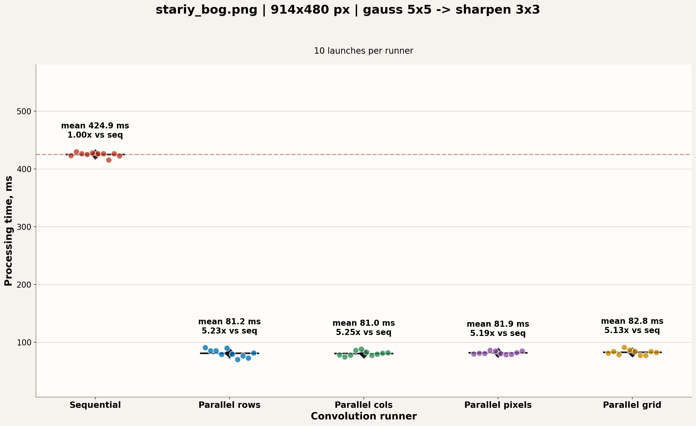
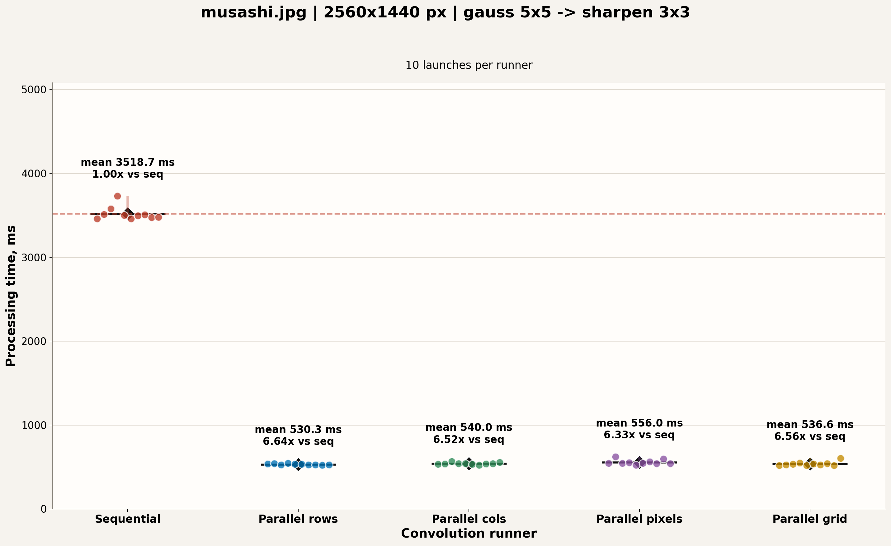
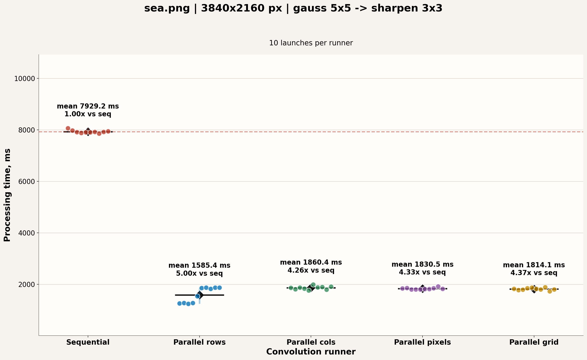
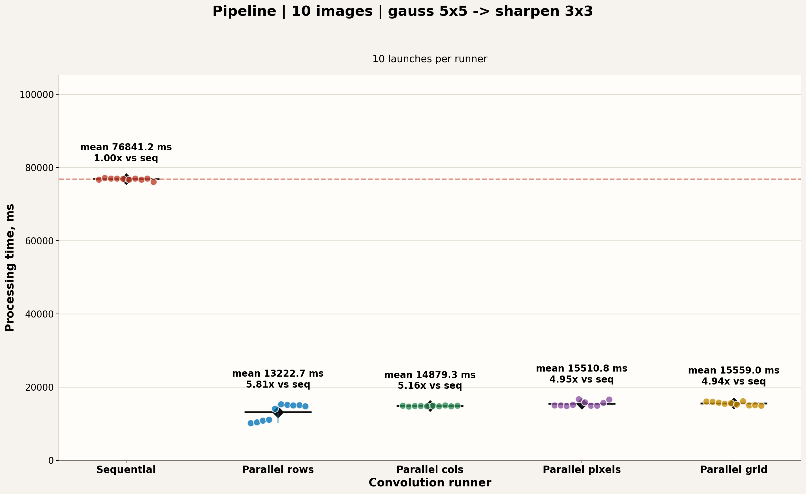

# Image Conversation

Image Conversation — консольное приложение для применения фильтров к одному изображению или к набору изображений.

## Запуск программы

### Сборка

Для обычного запуска программы достаточно собрать таргет `app` в release-конфигурации:

```bash
cmake -S . -B build -DCMAKE_BUILD_TYPE=Release -DBUILD_TESTING=OFF
cmake --build build --target app -j
```

После сборки исполняемый файл находится в `build/bin/app`.

### Пример для одного изображения

```bash
./build/bin/app \
  -i input/satoru.jpg -o output/satoru.jpg \
  -f gauss -h 5 -w 5 \
  -f sharpen -h 3 -w 3 \
  -p rows
```

### Пример для нескольких изображений

Для пакетной обработки нужно несколько раз передать пару `-i <input> -o <output>`. Набор фильтров и режим выполнения применяются ко всем изображениям из запуска.

```bash
./build/bin/app \
  -i input/satoru.jpg -o output/satoru.jpg \
  -i input/sunshine.jpg -o output/sunshine.jpg \
  -f gauss -h 5 -w 5 \
  -f sharpen -h 3 -w 3 \
  -p rows
```

### Аргументы запуска

Поддерживаются один или два фильтра за один запуск. Фильтр задаётся через `-f <filter> -h <height> -w <width>`. Для направленных фильтров можно дополнительно указать `-t <horizontal|vertical|diagonal|omni>`.

Доступные имена фильтров: `blur`, `mean`, `gauss`, `motion`, `edge`, `sharpen`, `emboss`, `median`.

Последний аргумент выбирает режим выполнения:

| Режим | Что делает |
|---|---|
| `-s` | последовательная свёртка |
| `-p rows` | параллельная обработка по строкам |
| `-p cols` | параллельная обработка по столбцам |
| `-p pixels` | параллельная обработка по пикселям |
| `-p grid` | параллельная обработка по прямоугольным блокам |

Справку по формату аргументов можно вывести так:

```bash
./build/bin/app --help
```

## Запуск тестов

Тесты подключены через CTest. Для их сборки нужна установленная `cmocka`.

```bash
cmake -S . -B build-tests -DCMAKE_BUILD_TYPE=Debug -DBUILD_TESTING=ON
cmake --build build-tests -j
ctest --test-dir build-tests --output-on-failure
```

## Как запустить бенчмарки у себя

Бенчмарки лучше запускать на release-сборке: debug-сборка исказит сравнение режимов свёртки.

```bash
cmake -S . -B build -DCMAKE_BUILD_TYPE=Release -DBUILD_TESTING=OFF
cmake --build build --target app -j
python3 scripts/benchmark_readme.py
```

Скрипт `scripts/benchmark_readme.py` запускает все режимы по 10 раз, сохраняет сырые данные в [`benchmarks/readme_benchmark_results.json`](benchmarks/readme_benchmark_results.json) и обновляет графики в `benchmarks/`. Для запуска нужны Python-пакеты `matplotlib`, `numpy` и `Pillow`.

Если нужно ограничить число потоков OpenMP, задайте `OMP_NUM_THREADS` перед запуском:

```bash
OMP_NUM_THREADS=8 python3 scripts/benchmark_readme.py
```

## Бенчмарки

Эта секция содержит уже полученные замеры. Команды для воспроизведения на своём компьютере приведены выше.

### Что измерялось

В текущих замерах сравнивается пайплайн из двух фильтров:

```text
gauss 5x5 -> sharpen 3x3
```

Время указано в миллисекундах. Один замер включает полный проход `image_pipeline_run`: чтение изображения, применение фильтров и запись результата. Каждый режим запускался 10 раз, в таблицах показано среднее время. Подробные значения всех запусков лежат в [`benchmarks/readme_benchmark_results.json`](benchmarks/readme_benchmark_results.json).

### Окружение

| Параметр | Значение |
|---|---|
| CPU | Intel(R) Core(TM) Ultra 5 125H |
| Architecture | x86_64 |
| Логических CPU | 18 |
| Список CPU | 0-17 |
| Ядер на сокет | 14 |
| Потоков на ядро | 2 |
| Максимальная частота CPU | 4600 MHz |
| Минимальная частота CPU | 400 MHz |
| L1d cache | 448 KiB |
| L1i cache | 768 KiB |
| L2 cache | 14 MiB |
| L3 cache | 18 MiB |
| RAM | 32260660 kB, примерно 30.8 GiB |
| Потоков OpenMP | 18 |
| Запусков на режим | 10 |

### Сокращения в таблицах

| Сокращение | Значение |
|---|---|
| `seq` | последовательная свёртка |
| `rows` | параллельная свёртка по строкам |
| `cols` | параллельная свёртка по столбцам |
| `pixels` | параллельная свёртка по пикселям |
| `grid` | параллельная свёртка по прямоугольным блокам |
| `ms` | миллисекунды |
| `Min` / `Max` | минимальное и максимальное время среди 10 запусков |
| `95% CI` | 95% доверительный интервал среднего значения |
| `CV` | coefficient of variation, относительный разброс `s / mean` |
| `x`, `speedup` | ускорение относительно последовательного режима `seq` |

### Краткие выводы

На маленьких изображениях все параллельные режимы близки друг к другу: накладные расходы на запуск потоков и синхронизацию уже заметны, поэтому разница между стратегиями небольшая.

На крупных изображениях лучше всего показал себя режим `rows`. Для `musashi.jpg` он дал ускорение примерно `6.64x`, а на пайплайне из десяти 4K-изображений — `5.81x`. Режимы `cols`, `pixels` и `grid` тоже дают существенное ускорение, но в этих замерах чаще уступают разбиению по строкам.

Основная причина преимущества `rows` на больших изображениях — лучшая кэш-локальность. Изображение хранится построчно: соседние пиксели одной строки лежат рядом в памяти, а расстояние между соседними строками равно количеству байт между началами двух этих строк с учетом возможного выравнивания. В режиме `rows` каждый поток получает непрерывный диапазон строк, последовательно читает и пишет большие линейные участки памяти, что обеспечивает лучшую кэш-локальность. В режиме `cols` потоки обрабатывают вертикальные полосы: внутри каждой строки доступ по-прежнему последовательный, но все потоки проходят одни и те же строки разными полосами, чаще пересекаются на границах кэш-линий и создают больше давления на кэш/TLB. В режиме `pixels` единица работы слишком мелкая, а `convolution_apply_pixel` выполняет проверки для каждого пикселя. В режиме `grid` локальность внутри плитки хорошая, но появляется больше мелких прямоугольных областей и накладных расходов на разбиение; на маленьких изображениях это иногда помогает, а на больших чаще проигрывает простому линейному проходу по строкам.

Если `cols` или `grid` в отдельной строке таблицы оказываются немного быстрее `rows`, это не обязательно ошибка в коде или в замерах. Например, для `stariy_bog.png` средние `cols = 81.0 ms` и `rows = 81.2 ms` отличаются меньше, чем доверительный интервал измерений. Для маленьких изображений накладные расходы потоков, планирование OpenMP, состояние CPU frequency scaling и фоновые процессы могут быть сравнимы с самой полезной работой. Поэтому небольшую разницу внутри погрешности стоит читать как статистически незначимую, а устойчивый вывод лучше делать по крупным изображениям и пакетному сценарию.

### Одно изображение

В этом сценарии один запуск программы обрабатывает одно изображение из `input/`.

#### Сводная таблица

<table>
  <thead>
    <tr>
      <th rowspan="2">Изображение</th>
      <th rowspan="2" align="right">Размер</th>
      <th colspan="5" align="center">Среднее время, ms</th>
      <th rowspan="2">Лучший параллельный режим</th>
    </tr>
    <tr>
      <th align="right"><code>seq</code></th>
      <th align="right"><code>rows</code></th>
      <th align="right"><code>cols</code></th>
      <th align="right"><code>pixels</code></th>
      <th align="right"><code>grid</code></th>
    </tr>
  </thead>
  <tbody>
    <tr>
      <td><code>satoru.jpg</code></td>
      <td align="right">225x225</td>
      <td align="right">53.1</td>
      <td align="right">13.7</td>
      <td align="right">14.5</td>
      <td align="right">14.9</td>
      <td align="right">13.3</td>
      <td><code>grid</code>, 3.99x</td>
    </tr>
    <tr>
      <td><code>sunshine.jpg</code></td>
      <td align="right">300x168</td>
      <td align="right">53.9</td>
      <td align="right">12.7</td>
      <td align="right">12.9</td>
      <td align="right">12.8</td>
      <td align="right">13.2</td>
      <td><code>rows</code>, 4.24x</td>
    </tr>
    <tr>
      <td><code>stariy_bog.png</code></td>
      <td align="right">914x480</td>
      <td align="right">424.9</td>
      <td align="right">81.2</td>
      <td align="right">81.0</td>
      <td align="right">81.9</td>
      <td align="right">82.8</td>
      <td><code>cols</code>, 5.25x</td>
    </tr>
    <tr>
      <td><code>musashi.jpg</code></td>
      <td align="right">2560x1440</td>
      <td align="right">3518.7</td>
      <td align="right">530.3</td>
      <td align="right">540.0</td>
      <td align="right">556.0</td>
      <td align="right">536.6</td>
      <td><code>rows</code>, 6.64x</td>
    </tr>
    <tr>
      <td><code>sea.png</code></td>
      <td align="right">3840x2160</td>
      <td align="right">7929.2</td>
      <td align="right">1585.4</td>
      <td align="right">1860.4</td>
      <td align="right">1830.5</td>
      <td align="right">1814.1</td>
      <td><code>rows</code>, 5.00x</td>
    </tr>
  </tbody>
</table>

#### Оценка погрешности

Погрешность ниже посчитана как 95% доверительный интервал среднего по 10 запускам: `mean ± 2.262 * s / sqrt(10)`, где `s` — выборочное стандартное отклонение. В скобках указан `CV = s / mean`, то есть относительный разброс.

| Изображение | `seq`, ms | `rows`, ms | `cols`, ms | `pixels`, ms | `grid`, ms |
|---|---:|---:|---:|---:|---:|
| `input/satoru.jpg` | 53.1 ± 2.3 (6.0%) | 13.7 ± 0.9 (9.0%) | 14.5 ± 2.1 (20.1%) | 14.9 ± 1.3 (12.3%) | 13.3 ± 0.9 (9.1%) |
| `input/sunshine.jpg` | 53.9 ± 1.9 (5.0%) | 12.7 ± 1.1 (12.5%) | 12.9 ± 1.1 (11.5%) | 12.8 ± 1.3 (13.8%) | 13.2 ± 0.7 (7.0%) |
| `input/stariy_bog.png` | 424.9 ± 2.8 (0.9%) | 81.2 ± 4.9 (8.4%) | 81.0 ± 3.0 (5.1%) | 81.9 ± 1.9 (3.2%) | 82.8 ± 3.1 (5.3%) |
| `input/musashi.jpg` | 3518.7 ± 58.6 (2.3%) | 530.3 ± 5.3 (1.4%) | 540.0 ± 8.9 (2.3%) | 556.0 ± 21.2 (5.3%) | 536.6 ± 18.3 (4.8%) |
| `input/sea.png` | 7929.2 ± 41.1 (0.7%) | 1585.4 ± 213.9 (18.9%) | 1860.4 ± 47.3 (3.6%) | 1830.5 ± 25.8 (2.0%) | 1814.1 ± 33.6 (2.6%) |

#### Подробно по каждому изображению

##### `satoru.jpg`, 225x225

<table>
  <thead>
    <tr>
      <th rowspan="2">Режим</th>
      <th colspan="3" align="center">Время, ms</th>
      <th rowspan="2" align="right">Ускорение относительно <code>seq</code></th>
    </tr>
    <tr>
      <th align="right">Среднее</th>
      <th align="right">Min</th>
      <th align="right">Max</th>
    </tr>
  </thead>
  <tbody>
    <tr><td><code>seq</code></td><td align="right">53.1</td><td align="right">49.0</td><td align="right">59.0</td><td align="right">1.00x</td></tr>
    <tr><td><code>rows</code></td><td align="right">13.7</td><td align="right">11.7</td><td align="right">15.7</td><td align="right">3.88x</td></tr>
    <tr><td><code>cols</code></td><td align="right">14.5</td><td align="right">11.6</td><td align="right">21.3</td><td align="right">3.66x</td></tr>
    <tr><td><code>pixels</code></td><td align="right">14.9</td><td align="right">13.0</td><td align="right">18.8</td><td align="right">3.56x</td></tr>
    <tr><td><code>grid</code></td><td align="right">13.3</td><td align="right">11.8</td><td align="right">15.3</td><td align="right">3.99x</td></tr>
  </tbody>
</table>



##### `sunshine.jpg`, 300x168

<table>
  <thead>
    <tr>
      <th rowspan="2">Режим</th>
      <th colspan="3" align="center">Время, ms</th>
      <th rowspan="2" align="right">Ускорение относительно <code>seq</code></th>
    </tr>
    <tr>
      <th align="right">Среднее</th>
      <th align="right">Min</th>
      <th align="right">Max</th>
    </tr>
  </thead>
  <tbody>
    <tr><td><code>seq</code></td><td align="right">53.9</td><td align="right">51.1</td><td align="right">59.3</td><td align="right">1.00x</td></tr>
    <tr><td><code>rows</code></td><td align="right">12.7</td><td align="right">9.2</td><td align="right">15.0</td><td align="right">4.24x</td></tr>
    <tr><td><code>cols</code></td><td align="right">12.9</td><td align="right">11.1</td><td align="right">15.7</td><td align="right">4.16x</td></tr>
    <tr><td><code>pixels</code></td><td align="right">12.8</td><td align="right">10.3</td><td align="right">16.4</td><td align="right">4.21x</td></tr>
    <tr><td><code>grid</code></td><td align="right">13.2</td><td align="right">12.1</td><td align="right">15.3</td><td align="right">4.09x</td></tr>
  </tbody>
</table>



##### `stariy_bog.png`, 914x480

<table>
  <thead>
    <tr>
      <th rowspan="2">Режим</th>
      <th colspan="3" align="center">Время, ms</th>
      <th rowspan="2" align="right">Ускорение относительно <code>seq</code></th>
    </tr>
    <tr>
      <th align="right">Среднее</th>
      <th align="right">Min</th>
      <th align="right">Max</th>
    </tr>
  </thead>
  <tbody>
    <tr><td><code>seq</code></td><td align="right">424.9</td><td align="right">415.5</td><td align="right">429.5</td><td align="right">1.00x</td></tr>
    <tr><td><code>rows</code></td><td align="right">81.2</td><td align="right">70.1</td><td align="right">90.7</td><td align="right">5.23x</td></tr>
    <tr><td><code>cols</code></td><td align="right">81.0</td><td align="right">74.9</td><td align="right">88.3</td><td align="right">5.25x</td></tr>
    <tr><td><code>pixels</code></td><td align="right">81.9</td><td align="right">78.8</td><td align="right">86.4</td><td align="right">5.19x</td></tr>
    <tr><td><code>grid</code></td><td align="right">82.8</td><td align="right">77.4</td><td align="right">91.4</td><td align="right">5.13x</td></tr>
  </tbody>
</table>



##### `musashi.jpg`, 2560x1440

<table>
  <thead>
    <tr>
      <th rowspan="2">Режим</th>
      <th colspan="3" align="center">Время, ms</th>
      <th rowspan="2" align="right">Ускорение относительно <code>seq</code></th>
    </tr>
    <tr>
      <th align="right">Среднее</th>
      <th align="right">Min</th>
      <th align="right">Max</th>
    </tr>
  </thead>
  <tbody>
    <tr><td><code>seq</code></td><td align="right">3518.7</td><td align="right">3457.5</td><td align="right">3730.4</td><td align="right">1.00x</td></tr>
    <tr><td><code>rows</code></td><td align="right">530.3</td><td align="right">519.6</td><td align="right">542.9</td><td align="right">6.64x</td></tr>
    <tr><td><code>cols</code></td><td align="right">540.0</td><td align="right">522.7</td><td align="right">567.3</td><td align="right">6.52x</td></tr>
    <tr><td><code>pixels</code></td><td align="right">556.0</td><td align="right">521.0</td><td align="right">619.9</td><td align="right">6.33x</td></tr>
    <tr><td><code>grid</code></td><td align="right">536.6</td><td align="right">517.9</td><td align="right">603.1</td><td align="right">6.56x</td></tr>
  </tbody>
</table>



##### `sea.png`, 3840x2160

<table>
  <thead>
    <tr>
      <th rowspan="2">Режим</th>
      <th colspan="3" align="center">Время, ms</th>
      <th rowspan="2" align="right">Ускорение относительно <code>seq</code></th>
    </tr>
    <tr>
      <th align="right">Среднее</th>
      <th align="right">Min</th>
      <th align="right">Max</th>
    </tr>
  </thead>
  <tbody>
    <tr><td><code>seq</code></td><td align="right">7929.2</td><td align="right">7856.4</td><td align="right">8061.1</td><td align="right">1.00x</td></tr>
    <tr><td><code>rows</code></td><td align="right">1585.4</td><td align="right">1237.3</td><td align="right">1871.2</td><td align="right">5.00x</td></tr>
    <tr><td><code>cols</code></td><td align="right">1860.4</td><td align="right">1761.9</td><td align="right">1990.6</td><td align="right">4.26x</td></tr>
    <tr><td><code>pixels</code></td><td align="right">1830.5</td><td align="right">1799.2</td><td align="right">1916.1</td><td align="right">4.33x</td></tr>
    <tr><td><code>grid</code></td><td align="right">1814.1</td><td align="right">1730.6</td><td align="right">1890.5</td><td align="right">4.37x</td></tr>
  </tbody>
</table>



### Пайплайн из 10 4K-изображений

В этом сценарии один запуск программы получает сразу 10 изображений размером 3840x2160. Это ближе к пакетной обработке: накладные расходы распределяются на больший объём работы, а разница между стратегиями распараллеливания становится заметнее.

<table>
  <thead>
    <tr>
      <th rowspan="2">Режим</th>
      <th colspan="3" align="center">Время, ms</th>
      <th rowspan="2" align="right">Ускорение относительно <code>seq</code></th>
    </tr>
    <tr>
      <th align="right">Среднее</th>
      <th align="right">Min</th>
      <th align="right">Max</th>
    </tr>
  </thead>
  <tbody>
    <tr><td><code>seq</code></td><td align="right">76841.2</td><td align="right">76084.9</td><td align="right">77188.1</td><td align="right">1.00x</td></tr>
    <tr><td><code>rows</code></td><td align="right">13222.7</td><td align="right">10178.5</td><td align="right">15360.2</td><td align="right">5.81x</td></tr>
    <tr><td><code>cols</code></td><td align="right">14879.3</td><td align="right">14739.1</td><td align="right">15006.5</td><td align="right">5.16x</td></tr>
    <tr><td><code>pixels</code></td><td align="right">15510.8</td><td align="right">14846.2</td><td align="right">16740.9</td><td align="right">4.95x</td></tr>
    <tr><td><code>grid</code></td><td align="right">15559.0</td><td align="right">14962.5</td><td align="right">16204.3</td><td align="right">4.94x</td></tr>
  </tbody>
</table>

Оценка погрешности для пакетного сценария:

| Режим | Среднее ± 95% CI, ms | Станд. отклонение, ms | CV |
|---|---:|---:|---:|
| `seq` | 76841.2 ± 225.5 | 315.2 | 0.4% |
| `rows` | 13222.7 ± 1615.3 | 2258.0 | 17.1% |
| `cols` | 14879.3 ± 64.9 | 90.8 | 0.6% |
| `pixels` | 15510.8 ± 511.8 | 715.5 | 4.6% |
| `grid` | 15559.0 ± 328.1 | 458.6 | 2.9% |

У `rows` в пакетном сценарии разброс заметно выше: первые четыре запуска были около 10.2-11.1 с, следующие — около 14.8-15.4 с. Поэтому среднее `rows` быстрее остальных режимов, но именно этот результат имеет самую широкую погрешность и требует аккуратной интерпретации.



<details>
<summary>Список изображений из пакетного сценария</summary>

| # | Файл | Размер |
|---:|---|---:|
| 1 | `171406-odin_udar_chelovek_dvojnoe_proniknovenie-prefektura_sajtama-odin_udar_chelovek-anime-rukav-3840x2160.jpg` | 3840x2160 |
| 2 | `172836-ikona-asfalt-dorozhnoe_pokrytie-most-zdanie-3840x2160.png` | 3840x2160 |
| 3 | `173960-galaktika_andromedy-galaktika-mlechnyj_put-zemlya-zvezda-3840x2160.jpg` | 3840x2160 |
| 4 | `175978-yastreb-hishhnaya_ptica-sokol-nauka-biologiya-3840x2160.jpg` | 3840x2160 |
| 5 | `176372-oblako-gora-voda-rastenie-prirodnyj_landshaft-3840x2160.jpg` | 3840x2160 |
| 6 | `176515-samolet-samolety-polet-reaktivnyj_samolet-aviaciya-3840x2160.jpg` | 3840x2160 |
| 7 | `176585-albert_ejnshtejn_iskusstvo-art-poster-dizajn-nauka-3840x2160.jpg` | 3840x2160 |
| 8 | `179158-kon-belye-pechen-nazemnye_zhivotnye-prirodnyj_landshaft-3840x2160.jpg` | 3840x2160 |
| 9 | `181366-nytol_herbal_30_tabletok-nosok-bunionektomiya-dostupnyj-prigonka-3840x2160.jpg` | 3840x2160 |
| 10 | `img3.akspic.ru-nebo-kosmicheskoe_prostranstvo-film-gorizont-atmosfera-3840x2160.jpg` | 3840x2160 |

</details>

