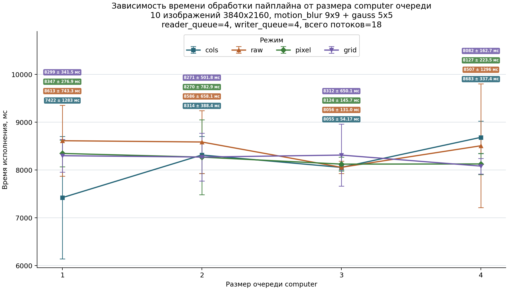

# Бенчмарк размера очередей пайплайна обработки изображений

Измерялась зависимость полного времени обработки пайплайна от размера очереди `computer`. Всего в пайплайне три очереди: `reader → computer → writer`.

## Параметры эксперимента

| Параметр | Значение |
|---|---:|
| Изображений | `10` (`3840x2160`) |
| Всего потоков | `18` |
| Reader threads | `2` |
| Writer threads | `2` |
| Computer budget | `14` |
| Размер reader queue | `4` |
| Размер writer queue | `4` |
| Размеры computer queue | `2, 3, 4, 5` |
| Запусков на кейс | `10` |
| Фильтры | `motion_blur 9x9 + gauss 5x5` |

## Режимы

Все 4 режима — параллельные (`cols`, `raw`, `pixel`, `grid`).
Каждый запускает 2 computer workers, каждый с `omp_set_num_threads(7)`.
Reader и writer — по 2 pthread-потока.

## Таблица результатов

| Computer queue | cols, мс | raw, мс | pixel, мс | grid, мс |
|---:|---:|---:|---:|---:|
| 1 | `7421.71 +- 1282.75` | `8612.90 +- 743.29` | `8346.87 +- 276.93` | `8299.32 +- 341.48` |
| 2 | `8313.90 +- 388.42` | `8586.23 +- 658.12` | `8269.55 +- 782.90` | `8271.16 +- 501.81` |
| 3 | `8054.89 +- 54.17` | `8056.21 +- 131.04` | `8123.54 +- 145.74` | `8312.45 +- 650.10` |
| 4 | `8683.15 +- 337.37` | `8507.49 +- 1295.75` | `8126.86 +- 223.49` | `8081.86 +- 162.74` |

## Лучшие конфигурации

- **cols**: минимум 7421.7 мс при computer_queue=1- **raw**: минимум 8056.2 мс при computer_queue=3- **pixel**: минимум 8123.5 мс при computer_queue=3- **grid**: минимум 8081.9 мс при computer_queue=4
